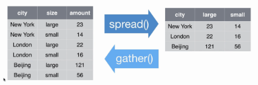

A lo largo de esta clase, trabajaremos con el paquete [__tidyverse__](https://www.tidyverse.org/). El mismo agrupa una serie de paquetes que tienen una misma lógica en su diseño y por ende funcionan en armonía.     
Entre ellos, usaremos principalmente __dplyr__ y __tidyr__ para realizar transformaciones sobre nuestro set de datos. En una futura clase utilizaremos __ggplot__ para realizar gráficos.   
      
A continuación cargamos la librería a nuestro ambiente. Para ello debe estar previamente instalada en nuestra pc.
```{r echo=TRUE, message=FALSE, warning=FALSE}
#install.packages("tidyverse")
library(tidyverse)
```

Para mostrar el funcionamiento básico de tidyverse utilizaremos a modo de ejemplo datos del [Informe mensual de estimaciones agrícolas del ministerio de agroiundustria.](https://www.agroindustria.gob.ar/sitio/areas/estimaciones/_archivos/estimaciones/190000_2019/191100_Noviembre/191121_Informe%20Mensual%2021%2011%2019.pdf).    
```{r echo=TRUE, message=FALSE, warning=FALSE}
CAMPANA <- c("2017/18","2018/19","2019/20",
            "2017/18","2018/19","2019/20",
            "2017/18","2018/19","2019/20")

CULTIVO <-     c("Soja","Soja","Soja",
                  "Trigo","Trigo","Trigo",
                    "Maíz","Maíz","Maíz")

PRODUCCION <-      c(55,37.78,55.3,
               18.4,18.5,19.46, 
               49.5,43.46,57)

AREA <- c(16.8,17,17.2,
          6,6.3,6.6,
          7.5,7.2,9)

Datos <- data.frame(CAMPANA,CULTIVO,PRODUCCION,AREA)
Datos
```

### Dplyr

El caracter principal para utilizar este paquete es ```%>%``` , _pipe_ (de tubería).   

Los ```%>%``` toman el set de datos a su izquierda, y los transforman mediante los comandos a su derecha, en los cuales los elementos de la izquierda están implícitos. En otros términos:  

$f(x,y)$ es equivalente a $x$ %>% $f(.,y)$ 

Veamos las principales funciones que pueden utilizarse con la lógica de este paquete:

#### str

Permite ver la estructura de la tabla. Nos muestra: 

* número de filas
* número de columnas
* nombre de las columnas
* tipo de dato de cada columna
* las primeras observaciones de la tabla


```{r }
str(Datos)

#equivalente a hacer Datos %>% str()
```

#### Summary

Permite ver la estructura de los datos de cada columna. En este caso se incorporan medidas estadisticas y se muestran cada factor.
```{r}
summary(Datos)
```


#### filter

Permite filtrar la tabla de acuerdo al cumplimiento de condiciones lógicas.

¿Cuál es la producción de Soja? 

*Atención!!!* Debe estar escrito igual que como esta en el registro.
 
```{r}
Datos %>% 
  filter(CULTIVO == "Soja")

#Si escribo CULTIVO == "SOJA" --> ERROR
``` 

Ahora si queremos conocer cuales son las campañas con la produccion de soja superior a las 40 MT, debemos tener un doble cumplimiento

```{r}
Datos %>% 
  filter(CULTIVO == "Soja" , PRODUCCION>40)

#EQUIVALENTE A HACER Datos %>% filter(CULTIVO == "Soja" & PRODUCCION>40)
```


Nótese que en este caso al separar con una  __,__ o _&_ las condiciones se exige el cumplimiento de ambas. En caso de desear que se cumpla alguna de las condiciones debe utilizarse el caracter __|__.

Todas las campañas de soja cumplen con al menos una de las dos condiciones y en el caso del maíz ocurre lo mismo.

```{r}
Datos %>% 
  filter(CULTIVO == "Soja" | PRODUCCION>40)
```

#### rename

Permite renombrar una columna de la tabla. Funciona de la siguiente manera:  
  
 ```Data %>% rename(nuevo_nombre = viejo_nombre)``` 

```{r}
Datos %>% 
  rename(GRANO = CULTIVO)

```

Nótese que, a diferencia del ejemplo de la función __filter__ donde utilizábamos __==__ para comprobar una condición lógica, en este caso se utiliza sólo un __=__ ya que lo estamos haciendo es _asignar_ un nombre.

Además, estamos trabajando sobre el dataset sin modificarlo, por lo tanto si entramos a verlo nuevamente permanece como estaba inicialmente. Con cualquiera de las 3 opciones:

*View() --> muestra todo el dataset
*head() --> muestra los 10 primeros registros
*hail() --> muestra los últimos 10 registros
```{r}
View(Datos)
head(Datos)
tail(Datos)
```

En caso de querer modificar el dataset tenemos que asignar las variaciones al mismo o a una nueva variable.

Veamos como se cambia el nombre de la columna en *Datos*.
```{r}
Datos <- Datos %>% 
  rename(GRANO = CULTIVO)

Datos
```
#### select
Permite especificar la serie de columnas que se desea conservar de un DataFrame. También pueden especificarse las columnas que se desean descartar (agregándoles un _-_ adelante). Muy útil para agilizar el trabajo en bases de datos de gran tamaño.

Queremos reordenar las columnas campaña, grano, area y producción.

```{r}
Datos <- Datos %>% 
  select("CAMPANA", "GRANO", "AREA", "PRODUCCION")
```
La función **select** tambien se puede aplicar luego de un filtro para obtener esa columna.

Solamente mostrar las campañas donde la soja tiene una producción a 40 MT

```{r}
Datos %>%
  filter(GRANO == "Soja" & PRODUCCION>40) %>% 
  select("CAMPANA")
```

#### mutate

Permite agregar una variable a la tabla (especificando el nombre que tomará ésta), que puede ser el resultado de operaciones sobre otras variables de la misma tabla.       

En caso de especificar el nombre de una columna existente, el resultado de la operación realizada "sobre-escribirá" la información de la columna con dicho nombre.

```{r}
Datos <- Datos %>% 
  mutate(RINDE = PRODUCCION / AREA)

Datos
```
El rinde se encuentra en tn/ha por lo tanto para si lo queremos pasar a quintales y guardarlo en la base deberiamos hacer el siguiente código.
```{r}
Datos$RINDE = Datos$RINDE*10

Datos
```

#### case_when

Permite definir una variable, de forma tal que tome un valor particular para cada condición establecida. 

La sintaxis de la función es:   
`case_when(condicion lógica1 ~ valor asignado1)`

Si querémos asignar un valor a todo lo que no cumple ningúna de las condiciones anteriores, podemos poner `TRUE ~ valor`

```{r}
Datos <- Datos %>% 
  mutate(CODIGO = case_when(GRANO == "Soja"    ~ "S",
                            GRANO == "Trigo"       ~ "T",
                            TRUE ~ "M"))

Datos
```

#### arrange

Permite ordenar la tabla según los valores de determinada/s variable/s. Es útil cuando luego deben hacerse otras operaciones que requieran del ordenamiento de la tabla, o para mostrar resultados de forma ordenada.

```{r}
Datos <- Datos %>% 
  arrange(AREA, PRODUCCION,RINDE)

Datos
```

#### summarise

Crea una nueva tabla que resuma la información original. Para ello, definimos las variables de resumen y las formas de agregación.

```{r}
Datos %>% 
  filter(GRANO == "Soja") %>% 
  summarise(RINDE_MAX = max(RINDE),
            RINDE_MIN = min(RINDE),
            RINDE_PROM = mean(RINDE))
```

#### group_by

Esta función permite realizar operaciones de forma agrupada. Lo que hace la función es "separar" a la tabla según los valores de la variable indicada y realizar las operaciones que se especifican a continuación, de manera independiente para cada una de las "subtablas". En nuestro ejemplo, vamos a calcular el rinde promedio por _CAMPANA_. 

```{r}
Datos %>% 
  group_by(CAMPANA) %>%
  summarise(CAMPANA_PROM = mean(RINDE))
```

### Joins

Otra implementación muy importante del paquete dplyr son las funciones para unir tablas (joins).

         


#### left_join    

Veamos un ejemplo de la función __left_join__ (una de las más utilizadas en la práctica).       
Para ello crearemos previamente un Dataframe que contenga ENSO y las precipitaciones para cada una de las campañas del Dataframe _Datos_.

**Nota**:Estos datos son inventados.

```{r}
Clima <- data.frame(CAMPANA = c("2017/18","2018/19","2019/20"),
                          ENSO = c("NIÑO", "NIÑA", "NEUTRO"),
                          PRECIPITACIONES = c(500, 1200, 850))

Clima
```

Unimos nuestras dos tablas. La siguiente forma de realizarlo es equivalente a:   
`Datos_join <- left_join(Datos, Clima, by = "CAMPANA")`

```{r}
Datos_join <- Datos %>% 
  left_join(Clima, by = "CAMPANA")

Datos_join
```

Finalmente, podemos calcular el rinde promedio de cada campaña según el ENSO.

```{r}
Datos_join %>% 
  group_by(ENSO) %>% 
  summarise(RINDE_PROMEDIO = mean(RINDE))
```

### Tidyr

El paquete tidyr está pensado para facilitar el emprolijamiento de los datos.

__Gather__ es una función que nos permite pasar los datos de forma horizontal a una forma vertical. 

__spread__ es una función que nos permite pasar los datos de forma vertical a una forma horizontal.



```{r}
# Utilizamos un conjunto de datos que viene con la librería datasets
library(datasets)

head(iris)
```

```{r}
iris <- iris %>% 
  mutate(id = 1:nrow(.)) %>%  # le agrego un ID
  select(id, everything())    # lo acomodo para que el id este primero. 

head(iris)
```

#### Gather y Spread

```{r}
iris_vertical <- iris %>% gather(., # el . llama a lo que esta atras del %>% 
                                 key   = Variables,
                                 value = Valores,
                                 2:5) #le indico qué columnas juntar
head(iris_vertical)
```

Podemos deshacer el __gather__ con un __Spread__
```{r}
iris_horizontal <- iris_vertical %>%
  spread(. ,
         key   = Variables, # la llave es la variable que va a dar los nombres de columna
         value = Valores) # los valores con que se llenan las celdas

head(iris_horizontal)
```

### Lubridate

El paquete lubridate está pensado para trabajar con los datos tipo fecha (date) o fecha-hora (datetime) para cambiarles el formato, realizar operaciones y extraer información

```{r}
#install.packages("lubridate")
library(lubridate)
```

#### Cambio de formato

Existe una gran cantidad de funciones para realizar esto. La idea general es poder llevar los objetos datetime a un formato común compuesto de los elementos: año, mes, día, hora, minuto y segundo (también se puede setear el huso horario)

```{r}
fecha  <- "04/12/92 17:35:16"
fecha
```

Con la función dmy_hms podemos convertir este string a una fecha: estamos indicando que el formato de la fecha es día(d), mes(m), año(y), hora(h), minuto(m) y segundo(s).

```{r}
fecha  <- dmy_hms(fecha)
fecha
```

**ATENCIÓN** que al verlo aparecera _yyyy-mm-dd_.

Muchas funciones de lubridate operan con esta misma lógica.   

Otra función para realizar un cambio de formato es *parse_date_time*. Permite construir objetos datetime a partir de datos más complejos, como por ejemplo cuando aparece el nombre del mes y el año.    

En el parámetro *x* pasamos el dato de la fecha y en el parámetro *orders* especificamos el orden en el cual se encuentra la información de la fecha.

```{r}
fecha2  <- "Dec-92"
fecha2 <- parse_date_time(fecha2, orders = 'my')
fecha2
```

#### Extracción de información

Existen muchas funciones muy sencillas para extraer información de un objeto datetime. Algunas son:

```{r}
year(fecha)  # Obtener el año
month(fecha) # Obtener el mes
day(fecha)   # Obtener el día
wday(fecha, label = TRUE) # Obtener el nombre del día
hour(fecha) # Obtener la hora
```

#### Operaciones

Podemos sumar o restarle cualquier período de tiempo a un objeto datetime

```{r}
# Sumo dos días 
fecha + days(2)
# Resto 1 semana y dos horas
fecha - (weeks(1) + hours(2))
```

Tambien podemos conocer el número de semana facilmente.

```{r}
week(fecha)
```

