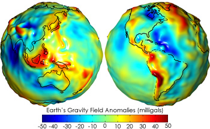
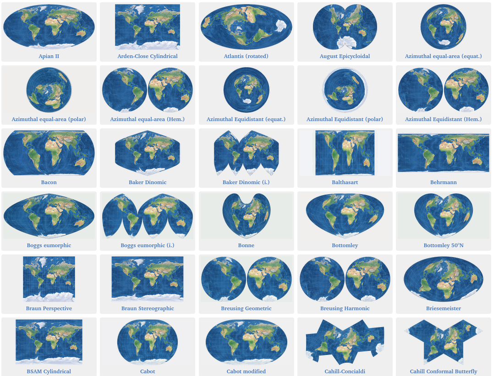
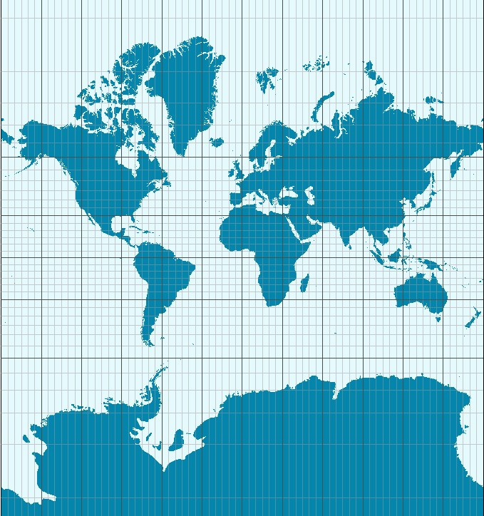

R cuenta con varios paquetes de funciones que permiten manipular información espacial con facilidad. A continuación vamos a aprender a combinarlos con las herramientas que hemos aprendido en las clases anteriores, para hacer análisis geográfico y crear nuestros propios mapas.


### Requisitos

```{r}
install.packages(c("sf","cartography"))
```


### Datos espaciales [^1]

El atributo que distingue a los datos georreferenciados, lo que los hace merecer ese nombre, es que representan ubicaciones exactas sobre la superficie de la Tierra. Representar en forma precisa una posición sobre la superficie terrestre es un todo un reto. Para empezar, la Tierra tiene una forma irregular. A pesar de cómo solemos imaginarla y dibujarla, no es una esfera perfecta sino que está “achatada” en los polos, dificultando la matemática necesaria para comparar posiciones y medir distancias.

<center>



</center>


Luego, está el problema de cómo mostrar sobre papel impreso, o en una pantalla digital, -superficies planas- rasgos geográficos que pertenecen a una superficie tridimensional esférica. La solución a estos problemas toma la forma de sistemas de coordenadas de referencia (CRS por sus siglas en inglés), y de proyecciones cartográficas.

Los CRS son un sistema de números que definen ubicaciones sobre la superficie de la Tierra; funcionan como direcciones. El tipo de CRS más conocido es el que usa latitud y longitud, para definir posiciones en los ejes norte-sur y este-oeste.

Las proyecciones cartográficas son instrucciones para traducir a un plano la disposición de puntos ubicados en la esfera terrestre. Algo así como las instrucciones para dibujar en dos dimensiones las disposición de fronteras, accidentes geográficos, calles o cualquier otro objeto que se extiende sobre la superficie curva del planeta. Como en toda traducción, hay algo que se pierde en el proceso. Todo los mapas “mienten”, en el sentido en que presentan una versión distorsionada de la superficie de terrestre. Esto es inevitable; no existe forma de pasar de la esfera al plano sin distorsionar la forma, la superficie, la distancia o la dirección de los rasgo geográficos. Existen muchísimas proyecciones distintas, cada una pensada para minimizar alguno de los tipos de distorsión, o para encontrar una solución de compromiso que los balancee.

[Proyecciones](https://map-projections.net/singleview.php)

<center>



</center>

La proyección más famosa es la Mercator, diseñada para asistir la navegación marítima y en uso desde el siglo XVI. Su fuerte es que no distorsiona las direcciones, por lo que permite fijar el rumbo de navegación consultando el mapa. Su principal problema es que produce una distorsión notable en las áreas cercanas a los polos: Groenlandia aparenta el mismo tamaño que toda África, cuando en realidad tiene sólo un quinceavo de su superficie. Por esa razón perdió la proyección popularidad en el siglo XX cuando comenzaron a preferirse proyecciones que respetan las áreas, como las de la Figura 6.1. Sin embargo, en el siglo XXI la proyección Mercator recuperó protagonismo. Google la eligió para sus mapas en línea, y por razones de compatibilidad otros proveedores de mapas digitales la adoptaron también. Así, y para inconsolable irritación de los geógrafos, Mercator se convirtió en el estándar de facto para aplicaciones geográficas en la web


<center>



</center>


En la práctica, si trabajamos en forma frecuente con archivos georreferenciados vamos a sufrir tarde o temprano de problemas de coordenadas o proyección. El más común de ellos: tener una fuentes de datos geográficos que no podemos comparar con otras, porque desconocemos el sistema de coordenadas que se usó para crearla; es decir, no podemos saber a que posición sobre el planeta corresponde cada observación en los datos.


### Formatos de archivos

El formato más común es el denominado “shapefile”, inventado por la empresa ESRI (los creadores del software ArcGIS). Es un formato incómodo porque guarda la información en varios archivos distintos, que suelen ser combinados en un archivo .zip para su distribución. Un inconveniente aún mayor es que los nombres de las variables en un shapefile deben tener 10 caracteres o menos, lo que facilita el uso de abreviaturas ininteligibles. A pesar de éstos y otros detrimentos, el formato es tan común que se ha vuelto sinónimo de archivo con información geográfica, y resiste a pesar de los esfuerzos por reemplazarlo con alternativas más modernas. Una de ellas es “GeoJSON”, un estándar abierto que corrige los dos inconvenientes mencionados antes. **Para nuestros ejercicios usaremos datos geográficos en formato geojson.**


### Explorando un archivo con información geográfica


```{r}
library(sf)
library(cartography)
library(tidyverse)
```

En este caso vamos a usar el geojson de departamentos disponible en [link](https://datos.gob.ar/is/dataset/ign-unidades-territoriales/archivo/ign_01.03.02)

También se creo recientemente el repositorio [IDERA](https://www.idera.gob.ar/)

```{r}
departamentos <- st_read("../datasets/departamentos/departamento.geojson")
```

Dediquemos un momento para describir la información que apareció al leer el archivo:

* `Simple feature collection with 530 features and 5 fields`: Cargamos una colección de “simple features” (entidades geométricas en la jerga de la cartografía digital), compuesta por 530 rasgos y 5 campos, que se traduce como 530 observaciones/filas con 5 variables/columnas.

* `geometry type:  MULTIPOLYGON`: los archivos con información geográfica contienen colecciones de puntos, de líneas, o de polígonos. En éste caso son polígonos; tiene sentido para la información que esperamos, que son los departamentos de Argentina.

* `dimension: XY`: la información es “plana”, en dos dimensiones X e Y. No incluye información de alturas, que estaría en la dimensión Z. Es lo típico, rara vez trabajaremos con archivos tridimensionales.

* `bbox: xmin: -74 ymin: -90 xmax: -25 ymax: -21.78113`: nos da cuatro valores que forman una “caja” (bounding box), el rectángulo que contiene todos los datos. Estos valores son la latitud mínima, la longitud mínima, la latitud máxima y la longitud máxima del conjunto de datos. Sólo es útil cuando tenemos mucha práctica y ya reconocemos lugares por sus coordenadas.

* `epsg (SRID): 4326` y `proj4string:    +proj=longlat +datum=WGS84 +no_defs`:  significan lo mismo, que nuestros datos usan el sistema de coordenadas WGS84, también conocido por su código EPSG 4326 . Es el mismo que usan los sistemas GPS, Google Maps, y las aplicaciones de internet en general. Es importante prestar atención al sistemas de coordenadas, o CRS, ya que para comparar datos geográficos de distintas fuentes todas deben usar el mismo.


Como con cualquier otro dataset, comenzamos nuestra exploración pidiendo su resumen:

```{r}
summary(departamentos)
```


Podemos sacar en limpio varias cosas. IN1, es el código que identifica cada departamento.

sag: 	Autoridad de fuente (SAG) responsable de la administración del dato de estas entidades. 
fna: Nombre geográfico (FNA) o nombre largo del departamento. 
gna:	Término genérico (GNA) o tipo de jurisdicción de la división político-territorial. 
nam:	Término específico (NAM) o nombre corto del departamento. 


### Viasualizacion de archivos de información geográfica

La función `plot` aplicada sobre la salida de la función `st_geommetry` nos gráfica la geométrica del dataset.

```{r fig.height = 8, fig.width = 5}
plot(st_geometry(departamentos), col = NA, border = "grey",axes = TRUE)
```
La figura parece un poco apretada. Veamos el CRS de esta figura
```{r}
st_crs(departamentos)
```
Es la proyección Mercator. Que distorsiona un poco las distancias lejanas al Ecuador.


Si quisiéramos descartar la Antártida Argentina para concentrarnos en el continente tenemos que recortar el bounding box.

```{r echo=TRUE,warning=FALSE, message=FALSE, fig.height = 8, fig.width = 5}

st_bbox(departamentos) #Vemos el bbox
box = c(xmin = -74 , ymin = -55, xmax = -45, ymax = -21) #construimos un box que se enfoque en el continente
departamentos<-st_crop(departamentos, box) #cortamos
plot(st_geometry(departamentos),col = NA, border = "grey", axes=T) #graficamos Argentina continental
```

Pero decíamos que la proyección mercator distorsiona un poco el tamaño del país. Si quisiéramos cambiar la proyección por la oficial que es la gauss-kruger o una aproximación ([Transverse Mercator](https://epsg.io/5345)). Debemos aplicar `st_transform` con el codigo crs correspondiente a la transformación que deseamos.

```{r}
#https://epsg.io/?q=Argentina%20kind%3APROJCRS
mapa_oficial<-departamentos %>% st_transform(crs = 5345)
st_crs(mapa_oficial)
```

Como podemos ver la proyección de mercator transverse no distorsiona la distancias de Argentina.
```{r fig.height = 8, fig.width = 5}
plot(st_geometry(mapa_oficial), col = NA, border = "gray",axes = TRUE)
```

### Mapear datos externos

Para poder mapear datos externos es necesario unir el dataset externo con el dataset que tienen la información geográfica. Esto lo hacemos con las funciones `join` que vimos en la segunda clase.

```{r}
#Genero variables ID.Provincia y ID.Departamento para join con Estimaciones
mapa_oficial<- mapa_oficial %>% mutate(ID.Provincia = substr(IN1, 1, 2),
                              ID.Departamento = substr(IN1, 3, 6)) %>% 
                      mutate(ID.Provincia = as.integer(ID.Provincia),
                              ID.Departamento = as.integer(ID.Departamento))

#Cargo dataset de estimaciones agrícolas
estimaciones <- read.table(file = '../datasets/Estimaciones.csv',sep=";", header = TRUE)

#Selecciono cultivo soja y campaña 2016/17
estimaciones <- estimaciones %>% 
  filter(Cultivo=="Soja total" & Campana=="2016/17" ) %>%
  mutate(Rendimiento..Kg.Ha. = as.numeric(Rendimiento..Kg.Ha.))

#Join de tablas
mapa_oficial <-  mapa_oficial %>% left_join(estimaciones, by = c("ID.Departamento","ID.Provincia"))
head(mapa_oficial)
```


Ahora podemos mapear la información. El paquete [Cartography](https://github.com/riatelab/cartography) tiene muchas funcionalidades.

Mapas choropleth se aplica la función `choroLayer`. Al igual que con ggplot los gráficos se construyen por capas. Tampoco es necesario recordar el código de memoria. Cuando haya que usarlo podemos visitar el [machete](http://riatelab.github.io/cartography/vignettes/cheatsheet/cartography_cheatsheet.pdf).


```{r fig.height = 8, fig.width = 6}
choroLayer(
  x = mapa_oficial, 
  var = "Rendimiento..Kg.Ha.",
  method = "geom",
  nclass=5,
  col = carto.pal(pal1 = "green.pal", n1 = 6),
  border = "gray", 
  lwd = 0.5,
  legend.pos = "topleft", 
  legend.title.txt = "Rendimiento\n(kg/ha)"
) 
```


Combinándolo con Tydiverse podemos transformar los datos fácilmente y mapearlos. Por ejemplo, a continuación cambiamos la unidades y el nombre de la variable que registra el rendimiento de la soja.
```{r fig.height = 8, fig.width = 6}
mapa_oficial  <- mapa_oficial %>% rename(Rinde = Rendimiento..Kg.Ha.) %>% mutate(Rinde = Rinde/1000)

plot(st_geometry(mapa_oficial), ylim=c(5.5e06,8.0e06))
choroLayer(
  x = mapa_oficial, 
  var = "Rinde",
  method = "geom",
  nclass=5,
  col = carto.pal(pal1 = "green.pal", n1 = 6),
  border = "gray", 
  lwd = 0.5,
  legend.pos = "topleft", 
  legend.title.txt = "Rendimiento\n(tn/ha)",
  add=T
) 


layoutLayer( title = "SOJA", tabtitle = TRUE, frame = TRUE, author = "Bolsa de Cereales", sources = "Fuente: PAS",  north = TRUE,  scale = 500)
```


También se pueden hacer mapas con más chiches

```{r fig.height = 8, fig.width = 6}
data("nuts2006")
mundo <- st_as_sf(world.spdf)  
plot(st_geometry(mundo), col  = "#E3DEBF", border = NA)


mundo <-  mundo %>% st_transform(crs = 4326)
plot(st_geometry(mundo), col  = "#E3DEBF", border = NA)


mapa_oficial <-  mapa_oficial %>% st_transform(crs = 4326)

plot(st_geometry(mundo), col  = "#E3DEBF", border = NA, ylim=c(-40,-20), xlim=c(-70,-52))
choroLayer(
  x = mapa_oficial, 
  var = "Rinde",
  method = "geom",
  nclass=5,
  col = carto.pal(pal1 = "green.pal", n1 = 6),
  border = "white", 
  lwd = 0.5,
  legend.pos = "topleft", 
  legend.title.txt = "Rendimiento\n(tn/ha)",
  add=T,colNA = "light gray"
) 


layoutLayer( title = "SOJA", tabtitle = TRUE, frame = TRUE, author = "Bolsa de Cereales", sources = "Fuente: PAS",  north = TRUE,  scale = 500)
```


[^1]: Esta clase es una adaptación del [capitulo 6 de Ciencia de Datos para gente sociable de A. Vazquez Burst](https://bitsandbricks.github.io/ciencia_de_datos_gente_sociable/informacion-geografica-y-mapas.html#los-datos-georreferenciados). 


